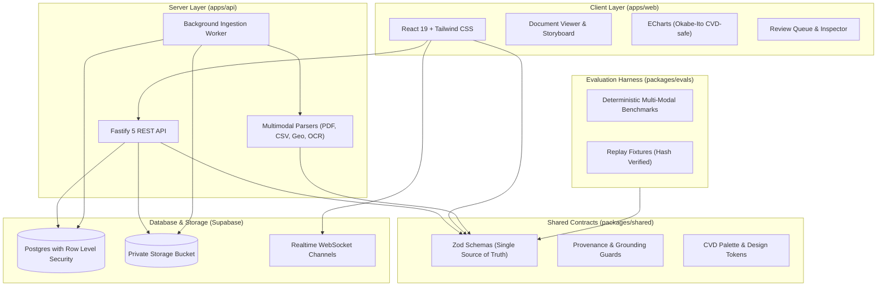

# Juris

**Document intelligence that never shows what it cannot prove.**

Juris reads dense public-finance, statutory, and spatial civic documents (budget speeches, allocation tables, municipal zoning boundaries, and scanned notifications) and turns them into verified facts, accessible charts, and plain-language summaries. Every number on screen links back to the exact verbatim quote and page or coordinates it came from. If Juris cannot prove something from the source, it remains silent.

[What it does](#what-it-does) | [Why you can trust it](#why-you-can-trust-it) | [Modality Matrix](#modality-matrix) | [Project status](#project-status) | [Quickstart](#quickstart) | [How it works](#how-it-works) | [Testing & Quality Gates](#testing-and-quality-gates) | [Architecture](#architecture) | [Contributing](#contributing)

---

## What it does

Budget speeches, procurement tenders, and civic notifications are long, full of figures, and hard to check. Juris gives analysts, journalists, and citizens a faster way to read them without compromising trust.

1. **Upload** documents by drag-and-drop:
   - Text PDFs (vector text layer with spatial bounding boxes)
   - CSV tabular datasets (multi-column fiscal tables)
   - Geospatial files (GeoJSON boundaries and KML ward layers)
   - Scanned notifications & images (PNG, JPEG, WebP)
2. **Watch** documents move through five real-time processing stages via WebSockets with polling fallback.
3. **Explore** the verified results:
   - **Facts**: each figure, allocation, obligation, and period, with a badge showing whether it was verified.
   - **Citations**: click any fact to open the exact quote, page number, and spatial bounding box on the document canvas.
   - **Overview**: automatically chosen charts (Okabe-Ito CVD-compliant), each with an accessible data-table view.
   - **Insights**: short civic summaries in which every sentence cites the underlying facts.
   - **Review Queue**: human-in-the-loop review tool for low-confidence OCR transcriptions and estimated chart values.
   - **Contradiction Resolution**: side-by-side comparison of conflicting passages when multiple sources disagree.
   - **Statutory Glossary**: defined terms with page references and verbatim statutory citations.
   - **Cryptographic Audit Trail**: immutable log of pipeline stages, SHA-256 hashes, and execution timestamps.
4. **Delete** a document and everything derived from it with complete database cascading and storage cleanup.

---

## Why you can trust it

Juris is built around one governing principle:

> **Provenance or silence.** No fact, summary, finding, risk, or chart value is shown without verified facts behind it.

Large language models can suggest candidate facts, but cannot be trusted to verify them. Juris enforces strict architectural separation of responsibilities:

- **The model proposes.** It suggests facts and must provide a verbatim quote from the source document.
- **Code verifies.** Deterministic code checks that the quote exists in the cited passage and that the number appears inside it. Facts that fail verification are preserved for audit inspection but never presented as facts.
- **Dual-computation for tabular data.** CSVs and numerical tables are computed independently via analytical queries and pure TypeScript routines. If results diverge by more than 0.01, facts are flagged.
- **Human confirmation gate (`AGENTS.md` Rule 8).** Automated agents and algorithms are strictly forbidden from marking review queue items approved; human review alone transitions items to `USER_CONFIRMED`.
- **Code chooses the charts.** Visual specifications and chart selectors are strictly deterministic; the model never generates chart data or coordinate arrays.
- **Empty is honest.** If an insight or summary lacks verified grounding, the interface displays an honest empty state instead of ungrounded text.

### Proof Types

Every extracted fact carries an auditable proof type describing its provenance:

| Proof Type       | Meaning                                                           | Used in Overview Charts                   |
| :--------------- | :---------------------------------------------------------------- | :---------------------------------------- |
| `VERIFIED`       | Verbatim quote and numbers confirmed in source text               | Yes                                       |
| `VERIFIED_OCR`   | Matched in OCR tokens above the 80% confidence floor              | Yes, with OCR badge                       |
| `COMPUTED`       | Recomputed independently by analytical engine and TS validator    | Yes                                       |
| `DERIVED`        | Calculated arithmetic from verified facts (growth, share, total)  | Yes, with displayed formula               |
| `USER_CONFIRMED` | Confirmed by a human analyst via the Review Queue                 | Yes                                       |
| `ESTIMATED`      | Extracted from low-contrast chart visual or poor scan (< 80% OCR) | Review Queue only                         |
| `CONFLICT`       | Two verified sources disagree on the same figure                  | Flagged, both passages shown side-by-side |
| `REJECTED`       | Failed mechanical verification or rejected by human reviewer      | Never; audit trail only                   |

---

## Modality Matrix

Juris supports 5 distinct civic modalities with dedicated parsing pipelines:

| Modality          | Formats                        | Processing Engine                                       | Verification Method                                             |
| :---------------- | :----------------------------- | :------------------------------------------------------ | :-------------------------------------------------------------- |
| **Text PDF**      | `.pdf`                         | PDF.js with coordinate stream & layout extraction       | Verbatim substring matching & coordinate anchoring              |
| **Tabular Data**  | `.csv`, `.tsv`                 | Analytical parser with dual-computation                 | Analytical query cross-checked against pure TS engine           |
| **Geospatial**    | `.geojson`, `.kml`             | Turf.js + Offline Gazetteer (`@juris/geodata`)          | Centroid calculation, bounding box, topology validation         |
| **Scanned Docs**  | `.pdf` (image), `.png`, `.jpg` | Tesseract.js / Vision Sidecar with 80% confidence floor | Word-level OCR confidence floor; items < 80% go to Review Queue |
| **Civic Notices** | `.txt`, `.md`                  | Sentence-boundary chunker & heading normalizer          | Verbatim quote verification against source chunk                |

---

## Project Status

All 12 roadmap phases are complete, tested, and verified on `main`:

| Phase        | Milestone                                                           | Status   |
| :----------- | :------------------------------------------------------------------ | :------- |
| **Phase 0**  | Workspace cleanup, hygiene, quality gates setup                     | Complete |
| **Phase 1**  | Evidence-graph contracts (`packages/shared`), RLS, DB schema        | Complete |
| **Phase 2**  | Design tokens, Okabe-Ito CVD palette, WCAG AA compliance            | Complete |
| **Phase 3**  | Visual engine, chart selector, and ECharts lazy loading             | Complete |
| **Phase 4**  | Core user journeys, App Shell, upload flow, live progress           | Complete |
| **Phase 5**  | Insight panel, sentence grounding checker, haptic feedback          | Complete |
| **Phase 6**  | Advanced PDF extraction, layout detection, Document Storyboard      | Complete |
| **Phase 7**  | CSV modality, tabular analytics, dual-computation validator         | Complete |
| **Phase 8**  | Geospatial modality (GeoJSON, KML), offline gazetteer               | Complete |
| **Phase 9**  | Images & scans pipeline, OCR confidence floor (80%), EXIF stripping | Complete |
| **Phase 10** | Review Queue (Rule 8 gate), Document Inspector, Conflict & Glossary | Complete |
| **Phase 11** | Evals hardening, multi-modal sweeps, palette guard, CI matrix       | Complete |
| **Phase 12** | Release readiness, threat model, complete documentation             | Complete |

---

## Quickstart

Run Juris locally in under 10 minutes.

### Prerequisites

- **Node.js**: 20.x or newer
- **pnpm**: 9.x or newer (`corepack enable && corepack prepare pnpm@latest --activate`)
- **Docker**: Docker Desktop or Colima running (required for local Supabase)
- **Supabase CLI**: `brew install supabase/tap/supabase`

### 1. Clone & Install Dependencies

```bash
git clone https://github.com/geetikavasistha-01/Juris.git
cd Juris
pnpm install
```

### 2. Start Local Database

```bash
supabase start
supabase db reset           # Applies all 10 migrations from scratch
supabase status -o env      # Outputs API_URL, ANON_KEY, and SERVICE_ROLE_KEY
```

### 3. Configure Environment

Create `apps/api/.env`:

```bash
PORT=3001
SUPABASE_URL=http://127.0.0.1:54321
SUPABASE_ANON_KEY=<ANON_KEY from supabase status>
SUPABASE_SERVICE_ROLE_KEY=<SERVICE_ROLE_KEY from supabase status>
STORAGE_BUCKET=documents
MAX_PDF_PAGES=50
MAX_UPLOAD_MB=25
LLM_MODE=replay               # replay | record | live
GEMINI_API_KEY=               # only needed for live mode
```

Create `apps/web/.env`:

```bash
VITE_SUPABASE_URL=http://127.0.0.1:54321
VITE_SUPABASE_ANON_KEY=<ANON_KEY from supabase status>
VITE_API_URL=http://localhost:3001
```

> **Security Note:** Never place the `SUPABASE_SERVICE_ROLE_KEY` into `apps/web/.env`. The client-side bundle is continuously audited by `secretlint` to block key exposure.

### 4. Run Development Servers

Run the stack using three terminals:

```bash
# Terminal 1: Fastify REST API
pnpm --filter api dev

# Terminal 2: Ingestion Worker (background queue)
pnpm --filter api worker

# Terminal 3: React Web Application
pnpm --filter web dev
```

Open `http://localhost:5173` in your browser.

---

## Architecture

Juris is structured as a TypeScript monorepo with strict contract boundaries:



### Monorepo Packages

- `apps/web`: Single-page application built with React 19, Vite, Tailwind CSS, and Apache ECharts (code-split, < 300 KB initial gzip).
- `apps/api`: Fastify 5 REST API server and persistent Postgres-backed background worker.
- `packages/shared`: Canonical Zod contracts, proof types, text normalizers, chart selectors, and grounding validators.
- `packages/geodata`: Offline gazetteer containing Indian civic boundaries, centroids, and bounding boxes.
- `packages/evals`: Evaluation harness with deterministic gold datasets across all 5 modalities.
- `supabase`: Declarative SQL migrations, RLS policies, custom types, and seed data.
- `e2e`: Playwright end-to-end tests for user journeys and interface states.
- `scripts`: Static verification guards (contrast, palette, forbidden terms, bundle budget, grounding).

---

## Testing and Quality Gates

All commits and pull requests must pass the complete quality matrix before merging:

```bash
# Static Guards & Compliance Checks
pnpm run check:forbidden         # Zero forbidden words (Rule 7)
pnpm run check:tokens            # Design token schema validation
pnpm run check:contrast          # 120 WCAG AA contrast pairs (Okabe-Ito)
pnpm run check:palette           # Colorblind-safe chart token compliance
pnpm run check:visual-specs      # Point-to-fact chart provenance
pnpm run check:insights-grounding # Sentence-level fact grounding
pnpm run check:bundle            # App shell bundle budget (< 300 KB Gzip)
pnpm run check:requirements      # Traceability across all 34 requirements
pnpm run check:fixtures          # SHA-256 fixture provenance & hash checks
pnpm run check:external-hosts    # Zero external CDN / font dependencies

# Build, Typecheck, Lint, Test
pnpm typecheck                   # Strict TypeScript across all packages
pnpm lint                        # ESLint scan across entire workspace
pnpm test                        # Vitest suite (180 tests across 26 suites)
```

---

## Security & Threat Model

Juris maintains a defense-in-depth posture:

- **Row Level Security (RLS)**: Every database table enforces RLS. Accessing another user's document returns `404 NOT_FOUND` to prevent IDOR and document presence enumeration.
- **Sidecar Sandboxing**: Multimodal parsers run in isolated worker contexts with CPU/RAM quotas and execution timeouts.
- **EXIF Stripping**: Image uploads are automatically stripped of location data, camera metadata, and timestamps before storage.
- **Decompression Bomb Protection**: Archive and vector parsers enforce strict uncompressed byte and vertex limits.
- **Zero Secrets in Frontend**: `secretlint` and custom CI guards ensure zero service role keys or sensitive tokens appear in client bundles.
- **No External Hosts**: All fonts, icons, styles, and WASM modules are 100% self-hosted; zero third-party CDNs.

See [`docs/threat-model.md`](docs/threat-model.md) for the complete security evaluation.

---

## Contributing

1. Work on short-lived branches prefixed by slice (`phase-<N>-<name>`).
2. Contracts first: modify `packages/shared` before API or Web code (`AGENTS.md` Rule 3).
3. Zero mock data in product code (`AGENTS.md` Rule 7).
4. Automated agents never mark evaluation items approved (`AGENTS.md` Rule 8).
5. Document every slice with an ADR in `docs/adr/` and an evidence report in `docs/evidence/`.

---

## Maintainer

Geetika Vasistha

## License

All rights reserved.
