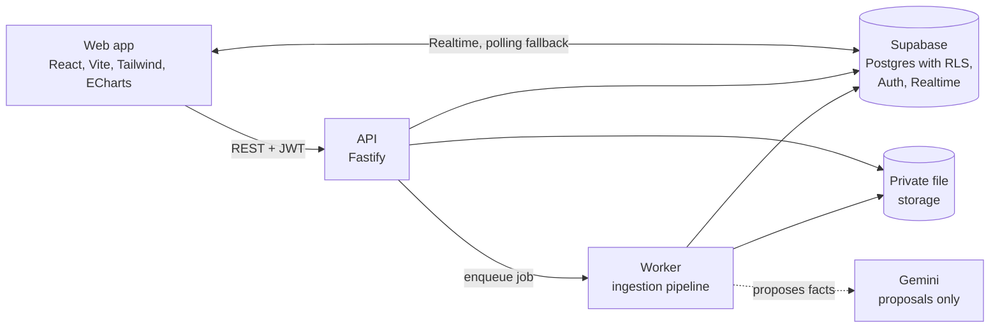
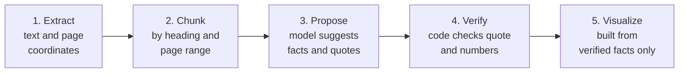

# Juris

**Document intelligence that never shows what it cannot prove.**

Juris reads dense public-finance and legal documents, such as budget speeches, and turns them into facts, charts and plain-language summaries. Every number on screen links back to the exact quote and page it came from. If Juris cannot prove something from the source, it says nothing.

[What it does](#what-it-does) | [Why you can trust it](#why-you-can-trust-it) | [Project status](#project-status) | [Quickstart](#quickstart) | [How it works](#how-it-works) | [Testing](#testing-and-quality-gates) | [Contributing](#contributing)

---

## What it does

Budget speeches and legal texts are long, full of figures, and hard to check. Juris gives you a faster way to read them without giving up trust.

1. **Upload** a PDF by drag and drop.
2. **Watch** it move through five processing stages in real time.
3. **Explore** the result:
   - **Facts**: each figure, allocation and period, with a badge showing whether it was verified.
   - **Citations**: click any fact to open the exact quote and page number.
   - **Overview**: automatically chosen charts, each with a data-table alternative.
   - **Insights**: short written explanations in which every sentence cites the facts behind it.
   - **Audit trail**: a record of what the system did and when.
4. **Delete** a document and everything derived from it, including the stored file.

### Who it is for

| Audience | What they get |
| :-- | :-- |
| Policy analysts and journalists | Allocations and fiscal figures found fast, each with proof of where it came from |
| Students and researchers | A way to skim a long document and trust that nothing was invented |
| Reviewers and auditors | A full trail of how every fact was extracted and verified |

---

## Why you can trust it

Juris is built around one rule:

> **Provenance or silence.** No fact, summary, finding, risk or chart value is shown without verified facts behind it.

Language models are good at finding candidate facts and bad at being right about them. So Juris separates the two jobs:

- **The model proposes.** It suggests facts and must copy a verbatim quote from the document.
- **Code verifies.** Deterministic code checks that the quote exists in the cited passage and that the number appears inside it. Facts that fail are kept for audit but never displayed as facts.
- **Code chooses the charts.** The model never writes chart data or numbers.
- **Empty is honest.** If a summary was not generated, the interface says so instead of showing filler text.

This is enforced in three places, not only in the interface:

| Layer | How the rule is enforced |
| :-- | :-- |
| Application code | Shared guards reject any analysis, chart or insight that lacks verified fact IDs |
| Database | Row Level Security isolates each user's data; constraints block ungrounded analysis rows |
| Tests | Unit, contract, isolation and end-to-end suites check the behavior, with no mocked claims about security |

### Proof types

Every fact carries a label describing how it was proven.

| Proof type | Meaning | Used in overview charts |
| :-- | :-- | :-- |
| `VERIFIED` | Quote and numbers found in the source text | Yes |
| `VERIFIED_OCR` | Matched in OCR tokens above a confidence floor | Yes, with a badge |
| `COMPUTED` | Recomputed by two independent code paths | Yes |
| `DERIVED` | Arithmetic from verified facts (share, growth, sum) | Yes, with the formula |
| `USER_CONFIRMED` | Low-confidence item a person approved | Only when opted in |
| `ESTIMATED` | Read from a chart image or poor scan | Only when opted in |
| `CONFLICT` | Two verified sources disagree | Flagged, both values shown |
| `UNVERIFIABLE` / `REJECTED` | Not provable | Never; visible in the audit trail |

---

## Project status

Juris is under active development. This table describes what exists today, so you can judge what to rely on.

| Capability | Status |
| :-- | :-- |
| PDF upload, text extraction, chunking | Working |
| Fact proposal (Gemini) and mechanical verification | Working |
| Library, live progress (WebSocket with polling fallback), document viewer | Working |
| Citation drawer, audit trail, document deletion | Working |
| Per-user isolation (API level, v1 tables) | Working and tested |
| Overview with automatically selected charts and cited insights | Working; chart selection currently runs in the browser |
| Light and dark themes, WCAG 2.1 AA checks | Working and tested |
| CSV, map (GeoJSON, KML) and image ingestion | **Experimental.** Not yet covered by the verification guarantee |
| Scanned PDFs and real OCR | Planned |
| Evidence-graph contracts and database hardening | In progress (Phase 1) |
| Cross-filtering, haptics, glossary, advanced table extraction | Planned |

Anything marked experimental or planned should not be treated as proven output. The full list of known gaps is in [`docs/known-gaps.md`](docs/known-gaps.md).

---

## Quickstart

Run everything on your own machine in about 15 minutes.

### Prerequisites

- Node.js 20 or newer
- pnpm 9 or newer
- Docker Desktop, running (local Supabase depends on it)
- Supabase CLI: `brew install supabase/tap/supabase`
- A Gemini API key, only if you want live extraction on new uploads (see [AI modes](#ai-modes-replay-record-live))

### 1. Install and start the database

```bash
git clone <repository-url>
cd Juris
pnpm install

supabase start
supabase status -o env      # prints API_URL, ANON_KEY and SERVICE_ROLE_KEY
supabase db reset           # applies all migrations from scratch
```

### 2. Configure environment files

Create `apps/api/.env`:

```bash
PORT=3001
SUPABASE_URL=http://127.0.0.1:54321
SUPABASE_ANON_KEY=<ANON_KEY from supabase status>
SUPABASE_SERVICE_ROLE_KEY=<SERVICE_ROLE_KEY from supabase status>
STORAGE_BUCKET=documents
MAX_PDF_PAGES=50
MAX_UPLOAD_MB=25
LLM_MODE=replay               # replay | record | live
GEMINI_API_KEY=               # only needed for live or record mode
```

Create `apps/web/.env`:

```bash
VITE_SUPABASE_URL=http://127.0.0.1:54321
VITE_SUPABASE_ANON_KEY=<ANON_KEY from supabase status>
VITE_API_URL=http://localhost:3001
```

> **Never put the service role key in the web environment.** It grants full database access and must stay on the server. The secret scanner will flag it.

### 3. Run the three processes

Use three terminals:

```bash
pnpm --filter api dev       # API on http://localhost:3001
pnpm --filter api worker    # background ingestion worker
pnpm --filter web dev       # web app on http://localhost:5173
```

### 4. Try it

1. Open <http://localhost:5173> and sign in as a guest.
2. Upload `docs/pdf/test_upload.pdf`.
3. Watch the five stages finish, then open the document.
4. Check the facts, open a citation, and look at the Overview.
5. Open the summary area. It stays empty until a grounded summary is generated, and says so.

### Troubleshooting

| Symptom | Likely cause and fix |
| :-- | :-- |
| `fetch failed` or timeouts | Docker is paused or still starting. Start it and run `supabase status` until all containers are healthy |
| Upload accepted but progress never moves | The worker is not running, or you are in live mode without `GEMINI_API_KEY`. Check `GET /api/health` |
| 401 on every API call | Web and API point at different Supabase instances. Copy the keys again from `supabase status` |
| Live progress events missing | Check that the realtime container is up. Polling takes over within 5 seconds and still completes the job |
| Port already in use | Change `PORT` or the Vite port, then update `VITE_API_URL` |

---

## How it works

### Architecture



### The ingestion pipeline

Every upload goes through five recorded stages. Each stage is idempotent: re-running it replaces its own output.



| Stage | What happens | Guarantee |
| :-- | :-- | :-- |
| Extract | PDF.js reads text with page numbers and coordinates | The same file always produces the same output (hash recorded) |
| Chunk | Text is split into sections that keep their heading path and page range | Raw and normalized text are both stored |
| Propose | The model suggests structured facts, each with a verbatim quote | Invalid output is dropped and counted |
| Verify | The quote must match the cited chunk (exact, then a documented fuzzy threshold), and the number must appear inside the quote | Failed facts are kept for audit and never shown as facts |
| Visualize | Charts and insights are built from verified facts only | Every chart point lists the fact IDs behind it |

Workers claim jobs with row locking so two workers never process the same job. Transient failures retry up to three times with backoff, and validation failures are never retried.

### AI modes: replay, record, live

All model access is controlled by `LLM_MODE`:

| Mode | Behavior | Use it for |
| :-- | :-- | :-- |
| `replay` (default) | Reads recorded model responses from `packages/evals`. Makes no network calls | Development, tests and CI. Fast, repeatable and free |
| `record` | Calls Gemini and saves the response as a fixture | Creating new test fixtures |
| `live` | Calls Gemini on new uploads | Real use. Requires `GEMINI_API_KEY` |

Pull request CI runs in replay mode and has no access to any LLM key. Live calls are for manual runs and scheduled evaluations only.

### Technology

| Area | Choice |
| :-- | :-- |
| Frontend | React 19, Vite, Tailwind CSS, React Router, ECharts (lazy loaded) |
| Backend | Fastify, a separate worker process |
| Data | Supabase: Postgres with Row Level Security, Auth, Realtime, private Storage |
| Shared contracts | Zod schemas in `packages/shared`, used by both API and web |
| Extraction | PDF.js (self-hosted fonts and cmaps) |
| AI | Gemini, proposing facts only |
| Tooling | TypeScript (strict), pnpm workspaces, ESLint, Vitest, Playwright, Axe |

### Repository layout

```text
apps/
  web/            React single-page app
  api/            Fastify server and ingestion worker
packages/
  shared/         Zod contracts, verification guards, normalization,
                  chart selector, grounding checker, parsers
  evals/          Recorded model responses and gold sets
supabase/         Migrations and local seed
e2e/
  real/           Playwright tests against the real stack
  ui-states/      Playwright tests of interface states
docs/             ADRs, branching guide, known gaps, sample PDF
scripts/          Quality-gate checks (contrast, bundle size, fixtures, ...)
```

### API overview

All errors share one envelope: `{ "error": { "code", "message", "requestId" } }`. All success responses parse against the schemas in `packages/shared`.

| Method and path | Purpose |
| :-- | :-- |
| `GET /api/health` | API, database and worker status |
| `GET /api/me` | Current user |
| `POST /api/upload` | Upload a file; returns a document ID and job ID |
| `GET /api/documents` | Library list |
| `GET /api/documents/:id` | Metadata, facts, analysis and visuals |
| `GET /api/documents/:id/chunks` | Text chunks |
| `GET /api/documents/:id/audit` | Audit trail |
| `GET /api/documents/:id/file` | The original file (owner only) |
| `POST /api/documents/:id/analysis` | Generate an optional grounded summary |
| `DELETE /api/documents/:id` | Delete the document and all derived data |

---

## Security and privacy

- **Isolation.** Every table uses Row Level Security. Requests for another user's document return `404 NOT_FOUND`, never `403`, so a document's existence is not revealed.
- **Private storage.** Files live in a private bucket, scoped by user.
- **Upload checks.** The server is authoritative: it verifies file signatures (not only extension or MIME type) and enforces size and page limits with typed error codes.
- **Secrets.** The service role key is server-only. Gitleaks and Secretlint run in CI.
- **No external hosts.** A check fails the build if the web app references any external host or CDN. Fonts and PDF resources are served locally.
- **Data sent to the model.** In `live` or `record` mode, extracted document text is sent to Gemini to propose facts. In `replay` mode nothing leaves your machine. Do not use live mode for documents you are not permitted to share with that provider.

---

## Testing and quality gates

Run from the repository root with Supabase running:

```bash
pnpm typecheck && pnpm lint
pnpm test                       # unit and integration (Vitest)
pnpm check:fixtures             # fixtures contain no authored summaries
pnpm check:tokens && pnpm check:contrast
pnpm check:external-hosts && pnpm check:forbidden
pnpm check:requirements         # every requirement ID has a test or code reference
pnpm build && pnpm check:bundle
pnpm e2e                        # Playwright: ui-states, then real stack
```

| Gate | Standard |
| :-- | :-- |
| Accessibility | WCAG 2.1 AA: 4.5:1 text contrast, 3:1 for non-text; Axe scans across 12 page, theme and viewport combinations |
| Performance | Initial web bundle under 300 KB gzipped; charts load on demand |
| Isolation | One user can never read, download or infer another user's documents |
| Provenance | No analysis, chart or insight without verified fact IDs |
| Stability | The full suite must pass twice in a row |

Tests are deliberately separated: `e2e/real` runs against the real stack and never mocks network routes, while `e2e/ui-states` covers interface states. Mocked tests do not claim to prove pipeline or security behavior.

---

## Roadmap

| Phase | Focus |
| :-- | :-- |
| 1 | Evidence-graph contracts, database constraints, stronger isolation tests |
| 2 | Server-side visual specs and chart-selection engine |
| 3 | Insight panel, grounding checker, optional model-written insights, glossary, haptics |
| 4 | Advanced PDF extraction: tables, normalization, reconciliation, derived facts, flags |
| 5 | CSV with independent dual-computation verification |
| 6 | Maps and geospatial data with gazetteer matching |
| 7 | Images and scanned PDFs with real OCR and a review queue |
| 8 | Hardening: accessibility sweep, performance budgets, security tests |

Product requirements are in the two PRDs: v1 (verified PDF ingestion) and v2 (multimodal extraction and interactive visual intelligence).

---

## Contributing

- `main` is protected and always green. Work happens on short-lived branches.
- Branch prefixes: `web/`, `api/`, `model/`, `db/`, or a phase name such as `phase-1-contracts-db`.
- Contracts and migrations merge first; layer-specific branches build on them.
- Commit scopes: `feat(web)`, `feat(api)`, `feat(model)`, `feat(db)`.
- Migrations are forward-only. Never edit a migration that has been merged.
- Follow the project rules: no placeholder content, no fabricated text, no emojis in the interface, docs or fixtures.

See [`docs/branching.md`](docs/branching.md) and the ADRs in [`docs/adr`](docs/adr).

---

## Disclaimer

Juris is a tool for reading and checking documents. It does not provide legal, financial or professional advice, and it does not interpret the law. Verified facts show that a figure appears in a source document; they do not show that the document itself is correct.

## Maintainer

Geetika Vasistha

## License

No license has been specified yet. Until one is added, all rights are reserved.
