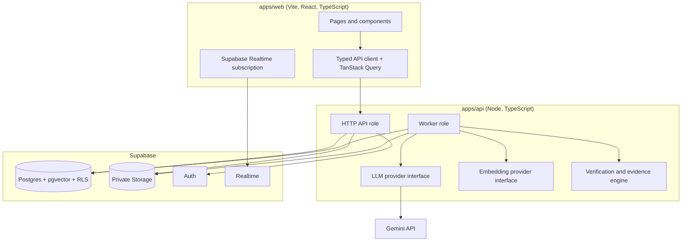

# Juris: Product Requirements Document

Status: draft for build. Audience: the human owner, and the AI IDE (this file lives in the repo at `docs/prd.md` and is the single source of truth).

Juris was first prototyped under the name CivilLens (v1). This version is written after that first attempt taught us what goes wrong. Section 1 turns each failure into a design rule. Everything after it follows those rules.

---

## 1. Lessons from v1 and the rules they produce

| What went wrong in v1                                                                                                     | Root cause                                           | Rule in v2                                                                                                                                                       |
| ------------------------------------------------------------------------------------------------------------------------- | ---------------------------------------------------- | ---------------------------------------------------------------------------------------------------------------------------------------------------------------- |
| UI showed invented numbers, a simulated pipeline, and fake telemetry                                                      | UI built first against mock data                     | **R1.** Backend and data first. No mock or simulated data in product code, ever. Demo content is real, pre-processed sample documents.                           |
| The LLM stage never completed on a real document                                                                          | Key problems found late; integration never exercised | **R2.** Day-0 spikes prove every risky integration (LLM, embeddings, PDF extraction, hosting) before any feature work.                                           |
| API keys committed, printed in commands and logs, pasted into chat                                                        | No secrets policy before the first commit            | **R3.** Secrets policy exists before the first commit: gitignore, scanner, redaction, local Supabase for development so production keys never exist on a laptop. |
| Charts rendered empty; data shapes drifted between frontend and backend; polling clashed with rate limits                 | No shared contract                                   | **R4.** TypeScript end to end with one shared schema package. The API client is typed from it. Contract tests run in CI.                                         |
| Stack changed mid-way (JSON files, then Supabase; Groq, then Gemini; anonymous guests, then real auth, then guests again) | Decisions made while coding                          | **R5.** Architecture decisions are written as short ADRs before building, and spikes decide the open ones.                                                       |
| Charts were filled by the LLM, so values could be fabricated                                                              | Accuracy treated as a prompt problem                 | **R6.** Evidence first: facts with quotes and locations, verified in code. Charts exist only for verified facts. A small gold set exists from week 1.            |
| "Complete, none outstanding" reports when only a build had run                                                            | Big prompts, unreviewed diffs, no proof required     | **R7.** Work in thin vertical slices. A slice is done only when it ran against real data and produced an evidence file. A passing build proves nothing.          |
| Docs claimed features that did not exist                                                                                  | Docs written separately from tests                   | **R8.** Every P0 requirement has an ID and a test. CI fails if a requirement has no test. Docs claim only what tests prove.                                      |
| Free-tier surprises (memory, rate limits, sleeping hosts, polling storms)                                                 | No capacity plan                                     | **R9.** A capacity and quota section exists. Quotas are designed in, shown in the UI, and tested.                                                                |
| Auth and abuse paths bolted on late                                                                                       | Security treated as a phase                          | **R10.** Threat model and RLS tests exist from the first slice.                                                                                                  |
| The AI IDE searched the home directory, read the clipboard, and edited global tool configuration while setting up         | No boundary rules for the agent                      | **R11.** The agent works only inside the repository; inputs are placed there by the human; every side effect is reported.                                        |

---

## 2. Product

**Problem.** Government documents (budgets, ordinances, minutes, reports, datasets) are long, dense, and hard for citizens, students, and journalists to read. Generic chatbots answer confidently but cannot show where a number came from.

**Product.** A signed-in user uploads a government PDF, spreadsheet, or pasted text. Juris extracts facts that are each tied to a page and a quote, verifies every number in code, and shows them as interactive visualizations. The user can chat with the document and gets cited answers, or an honest "not in this document".

**Primary users.** Citizens and students reading local budgets; journalists and researchers who need traceable figures.

**Goals and measurable targets**

| ID  | Goal                | Target (measured, published in `docs/eval/`)                                                                                               |
| --- | ------------------- | ------------------------------------------------------------------------------------------------------------------------------------------ |
| G1  | Trustworthy numbers | At least 95% of figures shown on dashboards are verified against their source; at least 90% exact-match accuracy on gold numeric questions |
| G2  | Traceable answers   | At least 95% citation page accuracy on the gold set; at least 90% correct abstention on unanswerable questions                             |
| G3  | Useful visuals      | For budget-type documents, at least 6 verified visualizations; none ever empty or unsupported                                              |
| G4  | Responsive          | Upload acknowledged in under 1 second; processing stages visible live; processing time reported per document, not promised                 |
| G5  | Safe                | Zero secrets in repo or logs (scanner clean); two-account isolation tests pass on every deploy                                             |

**Non-goals (v1).** Model training or fine-tuning; legal or financial advice; teams or organizations; mobile apps; scraping government sites; real-time collaboration; scanned PDFs and images as P0 (they are gated, see section 4).

---

## 3. Engineering principles (the contract with the AI IDE)

1. Thin vertical slices, each real end to end.
2. Contracts before code; tests before implementation.
3. Spikes before commitments; kill criteria are written down.
4. Evidence over assertion: every slice ends with an evidence file.
5. Fail loudly and early: clear error codes, no silent fallbacks, no "retrying" for errors that cannot succeed.
6. Boring, typed, measurable technology.
7. Everything is configuration: provider, model, limits, TTLs.
8. Least privilege: the browser never sees a secret; the database enforces ownership.

---

## 4. Scope by phase

| Priority           | Scope                                                                                                                                                                                                                                                                                            |
| ------------------ | ------------------------------------------------------------------------------------------------------------------------------------------------------------------------------------------------------------------------------------------------------------------------------------------------ |
| **v1 (P0)**        | Email and Google sign-in; text-layer PDFs and pasted text; async processing with live stages; evidence engine; visualizations with interactions; per-document cited chat with docked composer; library with real stats; seeded public samples; account and document deletion; quotas; deployment |
| **v1.1 (P1)**      | CSV/XLSX ingestion with table catalog and table chat (query plans); remaining chart catalog; chart switcher, period slider, compare periods                                                                                                                                                      |
| **v2 (P2, gated)** | Scanned PDFs and images via multimodal transcription (shipped only if spike S4 passes, and labelled experimental); cross-document chat; URL ingestion with SSRF protection; Hindi and regional-language documents; document comparison                                                           |

---

## 5. Requirements (each has an ID, a priority, and an acceptance test)

### Ingestion

| ID     | P   | Requirement                                                                                                                                                              | Acceptance                                                                     |
| ------ | --- | ------------------------------------------------------------------------------------------------------------------------------------------------------------------------ | ------------------------------------------------------------------------------ |
| ING-01 | P0  | Accept text-layer PDFs within limits; validate by magic bytes; store original in private storage; server computes SHA-256; detect duplicates per user                    | Tests: fake PDF rejected, oversize rejected, duplicate detected                |
| ING-02 | P0  | Accept pasted text (up to a configured size)                                                                                                                             | Test: creates document and runs the same pipeline                              |
| ING-03 | P0  | Upload returns within 1 second with a job id; stages are published live; jobs survive server restarts                                                                    | Test: kill the worker mid-job, restart, job resumes or fails with a clear code |
| ING-04 | P0  | Every failure has a machine code and a human message. Non-retryable errors (invalid key, blocked content, unsupported file) fail immediately. Retry uses the stored file | Tests for each error class                                                     |
| ING-05 | P1  | CSV and XLSX parsing with column profiling and row caps                                                                                                                  | Fixture tests                                                                  |
| ING-06 | P2  | Scanned PDFs and images via vision (gated by S4)                                                                                                                         | Defined after S4                                                               |

### Evidence engine

| ID     | P   | Requirement                                                                                                                                                                                                                                            | Acceptance                                                                              |
| ------ | --- | ------------------------------------------------------------------------------------------------------------------------------------------------------------------------------------------------------------------------------------------------------ | --------------------------------------------------------------------------------------- |
| EVD-01 | P0  | Extract facts: type, value, unit, currency, period, page, verbatim quote                                                                                                                                                                               | Schema tests                                                                            |
| EVD-02 | P0  | Verify each fact in code: quote exists on the cited page (fuzzy match), every number appears in the quote after normalizing separators, currency, and magnitude words (thousand, million, billion, lakh, crore). Failed facts are stored with a reason | Fixtures: hallucinated number dropped; wrong page dropped; crore and million normalized |
| EVD-03 | P0  | Summary and findings are generated only from verified facts; each sentence cites facts; a verifier pass removes unsupported sentences                                                                                                                  | Test: injected unsupported sentence is removed                                          |
| EVD-04 | P0  | Verification rate is stored per document and shown in the UI                                                                                                                                                                                           | UI and API test                                                                         |
| EVD-05 | P1  | Cross-checks (components sum to total within tolerance), deduplication across pages                                                                                                                                                                    | Fixture tests                                                                           |

### Visualization and dashboard

| ID     | P   | Requirement                                                                                                                                                                     | Acceptance                                  |
| ------ | --- | ------------------------------------------------------------------------------------------------------------------------------------------------------------------------------- | ------------------------------------------- |
| VIZ-01 | P0  | A visualization is created only from verified facts and carries source pages; no chart ever renders empty axes                                                                  | Component tests with empty and invalid data |
| VIZ-02 | P0  | First three: key figures strip (deltas computed in code), allocation by category, trend over periods                                                                            | E2E on a real sample                        |
| VIZ-03 | P1  | Remaining catalog: revenue versus expenditure, top line items, category share over time, risks matrix (labelled "model assessment"), timeline, entities and terms, document map | Per-chart fixture tests                     |
| VIZ-04 | P0  | Interactions: hover details, cross-filtering, drill-down to underlying line items, export (PNG, CSV), source drawer, data table toggle                                          | Playwright                                  |
| VIZ-05 | P1  | Chart switcher limited to valid types, period slider, compare two periods, view state in URL                                                                                    | Playwright                                  |
| VIZ-06 | P0  | Honest empty states: "N of M visualizations available" with the reason for each missing one                                                                                     | Component test                              |

### Chat

| ID     | P   | Requirement                                                                                                                             | Acceptance                |
| ------ | --- | --------------------------------------------------------------------------------------------------------------------------------------- | ------------------------- |
| CHT-01 | P0  | Hybrid retrieval (vector plus full text); answer only from retrieved context; citations validated server-side                           | Gold-set metrics          |
| CHT-02 | P0  | Abstain when the document does not contain the answer                                                                                   | Gold-set abstain items    |
| CHT-03 | P0  | Streaming, markdown rendering, persisted history per document                                                                           | E2E                       |
| CHT-04 | P0  | Docked composer at bottom center; citation chips open the PDF viewer at the page with the quote highlighted                             | Playwright                |
| CHT-05 | P1  | Tables: LLM produces a JSON query plan validated against the real schema and executed by whitelisted code; show "how this was computed" | Fixture tests             |
| CHT-06 | P1  | Daily quotas enforced and displayed; clear message when the LLM quota is exhausted                                                      | Test with a stubbed quota |
| CHT-07 | P2  | Chat across all documents                                                                                                               | Later                     |

### Accounts, library, platform

| ID      | P   | Requirement                                                                                        | Acceptance                                         |
| ------- | --- | -------------------------------------------------------------------------------------------------- | -------------------------------------------------- |
| AUTH-01 | P0  | Supabase Auth (email with confirmation, Google); RLS on every table; no custom auth endpoints      | Two-account isolation test in CI                   |
| AUTH-02 | P0  | Delete account removes files, chunks, facts, visuals, messages                                     | Test                                               |
| LIB-01  | P0  | Library with real stats computed from the user's documents                                         | E2E                                                |
| LIB-02  | P0  | Seeded sample documents (real pipeline output) readable while signed out                           | E2E                                                |
| PLT-01  | P0  | `/health` verifies LLM, database, embeddings, storage; UI shows an actionable banner when degraded | Test                                               |
| PLT-02  | P0  | Separate rate limiters (global, upload, chat, status reads); quotas per user                       | Load test: no self-inflicted 429 during normal use |
| PLT-03  | P0  | Secrets policy (section 9.4) enforced by tools                                                     | CI scanner                                         |
| PLT-04  | P0  | Structured logs with request and job ids; error tracking                                           | Verified in staging                                |
| PLT-05  | P0  | CI gates (section 11)                                                                              | Pipeline file                                      |
| PLT-06  | P1  | Retention and cleanup jobs                                                                         | Test                                               |

---

## 6. Architecture



**Stack (each is an ADR; open items are decided by spikes)**

| Area                              | Choice                                                                                                                                                                                          |
| --------------------------------- | ----------------------------------------------------------------------------------------------------------------------------------------------------------------------------------------------- |
| Language                          | TypeScript everywhere; pnpm workspaces; pinned Node version                                                                                                                                     |
| Frontend                          | Vite, React, React Router, TanStack Query, Tailwind with design tokens, framer-motion, react-markdown, pdfjs-dist                                                                               |
| Charts                            | Apache ECharts (tree-shaken) as the default, because it has treemap, sunburst, sankey, and heatmap built in and a smaller bundle; Plotly is the fallback. Decided by spike S5                   |
| Backend                           | Fastify with the Zod type provider (schema-driven routes, built-in pino); one Node service with `ROLE=api                                                                                       | worker | all` so the worker can be split out later |
| Database, auth, storage, realtime | Supabase. Development runs on the local Supabase stack (Docker), so production service keys never exist on a developer machine                                                                  |
| LLM                               | Gemini through the official Google Gen AI SDK behind a provider interface; model name from environment; structured output with a response schema, still validated with Zod                      |
| Embeddings                        | Behind a provider interface; default and dimension decided by spike S2 (hosted API versus a local model; memory limits of the free host decide). Store model name and dimension on every vector |
| Jobs                              | Postgres-backed queue (`claim_job` with `FOR UPDATE SKIP LOCKED`), `job_events` table, restart-safe                                                                                             |
| Testing                           | Vitest, Playwright, contract tests, LLM record/replay for deterministic CI                                                                                                                      |
| CI/CD                             | GitHub Actions; Render (API and worker); Netlify (web)                                                                                                                                          |

**Repository layout**

```
juris/
  apps/web/            Vite React TypeScript
  apps/api/            Fastify API + worker roles
  packages/shared/     Zod schemas, types, error codes, constants (the contract)
  packages/evals/      Gold set, harness, metrics
  supabase/            migrations, seed, config
  e2e/                 Playwright
  docs/                prd.md, adr/, threat-model.md, evidence/, eval/
  AGENTS.md            Rules for the AI IDE (section 12)
  requirements.yaml    Requirement IDs mapped to test files
```

---

## 7. Data model (Postgres)

`documents` (id, owner_id, input_type, original_name, storage_path, mime_type, size_bytes, sha256, page_count, status, stage, progress, error_code, error_message, is_sample, expires_at, created_at, updated_at)
`analyses` (document_id, doc_type, summary, key_findings, entities, risks, provider, model, prompt_version, verification_rate, timings)
`facts` (id, document_id, type, value, unit, currency, period, page, quote, verified, fail_reason)
`visualizations` (id, document_id, kind, title, spec, source_pages, fact_ids, position)
`chunks` (id, document_id, chunk_index, page_number, content, embedding vector(N), embedding_model, fts tsvector)
`conversations` and `messages` (role, content, sources jsonb)
`jobs`, `job_events`, `usage_counters` (owner_id, day, uploads, questions, llm_calls)
Later: `datasets` and `dataset_rows` for tables.

All tables have an owner path and RLS. Rows with `is_sample = true` are readable by everyone. Migrations are versioned and idempotent. `N` is set by the embedding decision (ADR-003).

---

## 8. Contracts

- All request, response, and event types live in `packages/shared` as Zod schemas. The API validates input and output with them; the web client is typed from them; no hand-written duplicate types.
- One error envelope: `{ error: { code, message, details? } }` with a closed list of codes (for example `LLM_KEY_INVALID`, `LLM_QUOTA`, `LLM_BLOCKED`, `FILE_TYPE`, `FILE_TOO_LARGE`, `DUPLICATE`, `NOT_FOUND`).
- Endpoints (all JWT-protected except health, config, samples): `GET /health`, `GET /config`, `GET /samples`, `POST /documents` (file), `POST /documents/text`, `GET /documents`, `GET /documents/:id`, `DELETE /documents/:id`, `POST /documents/:id/retry`, `GET /documents/:id/file` (signed URL), `GET /documents/:id/facts`, `GET /documents/:id/visualizations`, `POST /documents/:id/chat` (SSE), `GET|DELETE /documents/:id/conversation`, `GET /usage`, `DELETE /account`.
- Contract tests check every endpoint's real response against its schema. Live status uses Supabase Realtime, with a slow, backed-off polling fallback on its own rate limiter.

---

## 9. AI design

### 9.1 Pipeline

`validating` -> `extracting` (per-page text) -> `chunking` -> `embedding` -> `typing` -> `fact_extraction` -> `verification` -> `synthesis` -> `building_visuals` -> `done`. Each stage writes progress and a `job_events` row.

### 9.2 The evidence rule

1. Extraction returns facts with a verbatim quote and page; temperature 0; JSON schema output; Zod validation; one repair retry.
2. Code verifies each fact (EVD-02). Failures are stored with reasons, never shown as data.
3. Summaries and findings are generated from verified facts only, with citations, then checked by a verifier pass.
4. Tabular numbers are computed in code, never by the LLM.
5. Anything not found is shown as "not found in this document".

### 9.3 Safety

- Prompt injection: document text is delimited and treated as data; the model has no tools that act on it; tests include a document containing hostile instructions.
- Blocked, empty, or truncated model responses are distinct error codes.
- Prompt versions are stored; prompt files live in the repo and are reviewed like code.

### 9.4 Secrets policy (in place before the first commit)

- `.gitignore` for all env files exists in the first commit; only `.env.example` is committed.
- Gitleaks as a pre-commit hook and a CI job.
- Logger redacts authorization headers, API-key headers, and key-shaped strings.
- The service-role key lives only in the hosting provider's secret store. Local development uses the local Supabase stack.
- No `VITE_` variable holds anything secret.
- The AI IDE never prints or passes a secret in a command.

### 9.5 Determinism in CI

`LLM_MODE=live|record|replay`. CI runs in replay mode against recorded responses (free, stable). Live evaluations run manually or nightly with a dev key that has a low quota.

---

## 10. Evaluation plan

- A small gold set (10 items on 1 document) exists in week 1 and grows to at least 20 approved items across 3 documents (including unanswerable ones).
- AI may draft items and pre-check them (quote on page, number in quote); only the human review tool can mark an item approved.
- Metrics: key-fact recall and precision, number exact-match, citation page accuracy, abstention correctness, visualization value verification rate, retrieval recall at 8.
- CI gate: eval thresholds block merges that change prompts, models, or chunking. Reports go to `docs/eval/` with the model, prompt version, and date. State plainly that the drafting and answering models share a provider.

---

## 10a. Non-functional requirements

| Area                | Requirement                                                                                                                                                                                                                              |
| ------------------- | ---------------------------------------------------------------------------------------------------------------------------------------------------------------------------------------------------------------------------------------- |
| Security            | Server refuses to start in production without Supabase and JWT verification; CORS allowlist; helmet; separate limiters; RLS tests with two accounts on every deploy; no custom guest endpoint; sample documents are the only public data |
| Privacy             | Private bucket; signed URLs only; deletion removes everything; retention by configuration; no document text in logs                                                                                                                      |
| Performance budgets | Initial JS under 300 KB gzip excluding lazy chart chunks; dashboard skeleton under 2 seconds; no layout shift on chart load                                                                                                              |
| Reliability         | Idempotent jobs; backoff honoring provider retry hints; health checks; documented behavior when Gemini is down or rate-limited                                                                                                           |
| Capacity            | Written limits: file size, pages, rows, characters, uploads and questions per user per day, concurrent jobs, derived from the actual Gemini quota found in spike S1                                                                      |
| Observability       | Structured logs with request and job ids; error tracking; job events visible to the owner; cost counters (LLM calls and tokens per document)                                                                                             |
| Accessibility       | Keyboard operable, focus management, text alternatives for charts, AA contrast in both themes, reduced motion                                                                                                                            |

---

## 11. Risks, spikes, and kill criteria

Each spike is time-boxed (about half a day to one day), run with real data, and ends with an ADR. Do not start feature slices until all pass or the fallback is chosen.

| Spike             | Question                                                                                  | Pass criteria                                                                                                                                                        | Fallback                                                            |
| ----------------- | ----------------------------------------------------------------------------------------- | -------------------------------------------------------------------------------------------------------------------------------------------------------------------- | ------------------------------------------------------------------- |
| S1 LLM            | Does Gemini structured output work reliably on a 50-page document within free-tier quota? | At least 95% valid JSON after one repair; 429 and blocked responses handled; real per-document call count and latency recorded; quota written into the capacity plan | Use a different model name; split chunks smaller; lower concurrency |
| S2 Embeddings     | Which provider and dimension?                                                             | Recall at 8 of at least 0.85 on 20 test questions; memory fits the target host                                                                                       | Alternative hosted embedding API                                    |
| S3 PDF extraction | Which library gives per-page text that matches the viewer's text layer?                   | At least 95% of sampled quotes found by the viewer's search; acceptable speed                                                                                        | Another extractor                                                   |
| S4 Vision         | Can images and scanned pages be transcribed accurately?                                   | Two independent passes agree on at least 90% of figures on 10 test pages                                                                                             | Ship as transcript-only, no charts, labelled experimental           |
| S5 Charts         | Which chart library fits the bundle budget and interactions?                              | Six chart types with cross-filtering rendered from fixtures within the bundle budget                                                                                 | Plotly with partial bundles                                         |
| S6 Hosting        | Do Render, Supabase, and Realtime work together on free tiers?                            | Hello-world API plus worker plus browser realtime works end to end; cold start and memory measured; limits documented                                                | Different host for the worker                                       |
| S7 Isolation      | Do RLS and storage policies hold?                                                         | Two-account tests pass at database, API, and storage levels                                                                                                          | Fix policies before continuing                                      |

---

## 12. Delivery plan

**Phase 0: Foundations (about 2 to 3 days).** Repo and workspace, TypeScript config, AGENTS.md, secrets policy and gitleaks, `.env.example`, CI skeleton, local Supabase, design tokens and logo carried over, ADR template, `requirements.yaml`, and a CI check that fails if product code contains simulated or mock data strings outside tests.

**Phase 1: Spikes S1 to S7 (about 1 week).** Output: ADRs 001 to 007, a measured capacity plan, a first 10-item gold set.

**Phase 2: Walking skeleton (about 1 week).** Sign in, upload a text PDF, worker extracts, one verified fact, one chart (key figures), one cited chat answer, deployed to staging, CI green, one eval item passing. Everything real. This slice proves the architecture before any breadth.

**Phase 3: Vertical slices (about 4 to 6 weeks).** Order:

1. Ingestion hardening (limits, duplicates, retry, quotas, stages, failure codes).
2. Evidence engine (typing, facts, verification, synthesis, cross-checks).
3. Dashboard (first three charts, then catalog, interactions, honest empty states).
4. Chat (retrieval, streaming, citations, viewer highlight, history, quotas).
5. Library, samples, account deletion, retention.
6. Tables (CSV and XLSX, table charts, query-plan chat).
7. Vision (only if S4 passed).

**Phase 4: Hardening and launch (about 1 to 2 weeks).** Threat-model tests, failure drills (Gemini 429 and timeouts, worker crash), accessibility and performance passes, README and evaluation report, deployment, smoke test from a clean browser profile.

(All durations are rough estimates for a solo, part-time builder using an AI IDE; adjust after the walking skeleton.)

**Definition of done for every slice**

1. Contracts updated in `packages/shared`; types flow to the web app.
2. Tests written first and passing in CI.
3. Ran against a real document; evidence file `docs/evidence/<slice>.md` lists commands run (redacted), what was observed, screenshots, and a "not verified" list.
4. No mock or simulated data in product code.
5. `requirements.yaml` updated; every touched P0 requirement maps to a test.
6. The human has done the gate checks and signed off.

---

## 13. AGENTS.md (rules for the AI IDE; save as `AGENTS.md` in the repo root)

```
# Rules for AI coding agents on Juris

1. Read docs/prd.md and docs/adr/ before changing anything. If a decision is not recorded, ask the human; do not invent.
2. Work on one slice at a time. Do not touch files outside the slice scope.
3. Contracts first: change packages/shared before the API or web code. No duplicated types.
4. Tests first. A task is not done until tests pass in CI and the code was run against real data.
5. A passing build proves nothing. Report what you ran, what you saw, and what you could not verify.
6. Never print, echo, log, or pass secrets in commands or output. Read them from the environment only. Never use a VITE_ variable for anything secret.
7. No mock, simulated, or invented data in product code. Fixtures and recorded LLM responses are allowed in tests only.
8. Never mark evaluation items approved; only the human review tool can.
9. Errors must use the shared error envelope and codes. Never retry non-retryable errors. No silent fallbacks.
10. Keep provider, model, limits, and TTLs in configuration, not in UI text or constants.
11. Small commits with clear messages. Do not rewrite git history.
12. Finish every task with docs/evidence/<slice>.md: commands run (secrets redacted), observed results, screenshots, and a "not verified" list.
13. Stay inside the repository. Never search the home directory, read the clipboard, read other projects' or other tools' data, or modify files outside the repo (including IDE and MCP configuration). If a needed file is missing, stop and ask.
14. Never run destructive commands (git reset --hard, git clean, git checkout -- ., force push, amend or rebase of existing commits, rm -rf outside a scratch folder) without my explicit approval. To test a hook, use a new branch with only the test file staged.
15. List every side effect (files changed outside the task scope, packages installed, processes started or stopped) under "Side effects" in the evidence file.
```

**Slice prompt template**

```
Slice <N>: <name>.
Read: docs/prd.md sections <list>, docs/adr/<list>, AGENTS.md.
Scope: <what is in>. Not in scope: <what is out>.
Steps: 1) extend contracts in packages/shared; 2) write failing tests for requirements <IDs>; 3) implement; 4) run against these real fixtures: <files>; 5) write docs/evidence/<slice>.md; 6) stop and wait for review.
Acceptance: <requirement IDs and their acceptance tests>.
```

---

## 14. CI gates

Typecheck, lint, unit tests, contract tests, secret scan, forbidden-strings check (no simulated or mock data in product code), requirements-to-tests traceability check, Playwright smoke test (every route signed in and out, fails on console errors), evaluation run in replay mode with thresholds, production build with bundle-size budget. Live evaluations run on demand.

---

## 15. Document set

`docs/prd.md` (this file), `docs/adr/NNN-title.md` (one page per decision), `docs/threat-model.md` (abuse cases: prompt injection, cross-user access, quota exhaustion, upload abuse), `docs/eval/` (reports), `docs/evidence/` (per-slice proof), README with a status table that links each claimed feature to its test.

---

## Appendix A: What to carry over from v1

Logo mark files and the theme-aware logo component (the wordmark still says CivilLens and must be redrawn as Juris); design tokens (navy, teal, serif headings, dark and light palettes); copywriting you liked; the SQL ideas (`claim_job`, hybrid search function, RLS patterns); the evaluation ideas and any questions already reviewed; your sample PDFs and their source list; the lessons table in section 1. Do not copy v1 code wholesale; reimplement it against the new contracts so the rules hold.

## Appendix B: Launch checklist

Secret scan clean on a fresh clone; two-account isolation passes on the deployed system; account deletion verified; privacy page, terms, and an "AI can be wrong, verify against the source" disclaimer visible; evaluation report published; health endpoint green; seeded samples present; smoke test from a clean browser profile; README states limits honestly (no enterprise-scale or perfect-accuracy claims).
